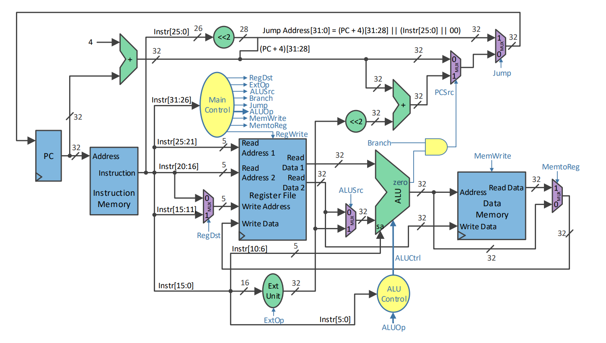
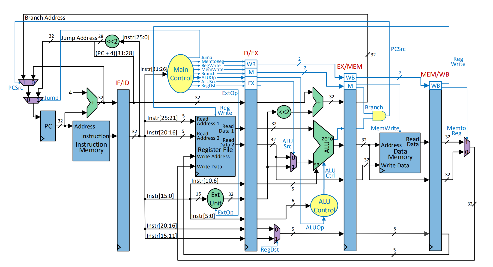

# 32-bit MIPS Processor Implementations (Single-Cycle & Pipelined)

This repository contains two complete 32-bit MIPS microprocessor architectures designed from scratch in VHDL: a foundational **Single-Cycle** datapath and an extended **Pipelined** model. Both designs have been implemented, synthesized, and validated on a **Nexys FPGA** board using Xilinx Vivado.

## Architecture References

The architectural design and datapath routing for both the single-cycle and pipelined models are heavily based on the classic schematics presented in *Computer Organization and Design* by David A. Patterson and John L. Hennessy.

> **Note:** The diagrams below are textbook conceptual references. The actual VHDL implementation in this repository contains custom modifications (such as extended datapath logic for `BNE` instruction) and specific resource optimizations that differ slightly from these standard schematics.

### Single-Cycle Datapath Reference
---


### Pipelined Datapath Reference
---



## Architecture & Implementation Details

### Core Hardware Modules
* `IFetch.vhd`: Instruction Fetch unit containing the PC and a 256×32-bit Instruction ROM.
* `IDecode.vhd`: Instruction Decode & Register File logic with immediate sign/zero extension.
* `MainControl.vhd`: Generates main control signals from instruction opcodes.
* `ExecutionUnit.vhd`: Arithmetic Logic Unit (ALU) and branch address calculation.
* `MEM.vhd`: Data memory block (256×32-bit RAM).
* `MPG.vhd`: Mono-pulse generator for mechanical button debouncing on the FPGA.
* `SSD.vhd`: Seven-segment display controller for real-time hardware status monitoring.
* `test_env.vhd`: Top-level wrapper tying all components and I/O peripherals together.

### Supported Instructions & Control Signals

| Instruction | Type | Opcode | RegDst | RegWrite | ALUSrc | ExtOp | ALUOp(2:0) | MemWrite | MemtoReg | BranchEQ | BranchNE | Jump |
|:--- |:---:|:---:|:---:|:---:|:---:|:---:|:---:|:---:|:---:|:---:|:---:|:---:|
| **R-Type** | R | `000000` | 1 | 1 | 0 | 0 | `111` | 0 | 0 | 0 | 0 | 0 |
| **ADDI** | I | `001000` | 0 | 1 | 1 | 1 | `000` | 0 | 0 | 0 | 0 | 0 |
| **ANDI** | I | `001100` | 0 | 1 | 1 | 0 | `010` | 0 | 0 | 0 | 0 | 0 |
| **SLTI** | I | `001010` | 0 | 1 | 1 | 1 | `011` | 0 | 0 | 0 | 0 | 0 |
| **LW** | I | `100011` | 0 | 1 | 1 | 1 | `000` | 0 | 1 | 0 | 0 | 0 |
| **SW** | I | `101011` | X | 0 | 1 | 1 | `000` | 1 | X | 0 | 0 | 0 |
| **BEQ** | I | `000100` | X | 0 | 0 | 1 | `001` | 0 | X | 1 | 0 | 0 |
| **BNE** | I | `000101` | X | 0 | 0 | 1 | `001` | 0 | X | 0 | 1 | 0 |
| **J** | J | `000010` | X | 0 | X | X | `XXX` | 0 | X | 0 | 0 | 1 |

### Highlights & Design Decisions
* **Multiplication (`mult`):** Evaluated using Vivado's standard `*` operator on lower 16-bit operand halves to avoid full 64-bit hardware accumulator expansion overhead.
* **Modulo Arithmetic:** Implemented iteratively in software via repeated subtractions to preserve hardware resources on the FPGA.
* **Memory Units:** Both Instruction ROM (`IFetch`) and Data RAM (`MEM`) are sized to 256×32-bit (8-bit addressing space), minimizing resource utilization and synthesis times.
* **Pipeline Debug Logic:** The pipelined implementation contains custom step/debug support to inspect register states and handle execution flows directly on the hardware board.

---

## Validation: Primality Test

The functionality of both architectures was validated by running a bare-metal primality-testing algorithm written directly in MIPS assembly. 

* **Input:** A 32-bit integer loaded from memory address `0x00`.
* **Output:** Stored at address `0x04` (`1` if prime, `0` if composite).

```c
    // Algorithm Logic (C Reference)
    bool isPrime(int n) {
        if (n < 2) return false;
        if (n == 2) return true;
        if ((n & 1) == 0) return false;

        for (int d = 3; d * d <= n; d += 2) {
            if (n % d == 0)
                return false;
        }
        return true;
    }
```
### MIPS Assembly & Machine Code
```
    lw   $1, 0($0)       # 0x8C010000 - Load n into $1
    slti $3, $1, 2       # 0x28230002 - Check if n < 2
    bne  $3, $0, 18      # 0x14600012 - If true, branch to ret_0
    addi $4, $0, 2       # 0x20040002 - $4 = 2
    beq  $1, $4, 14      # 0x1024000E - If n == 2, branch to ret_1
    andi $3, $1, 1       # 0x30230001 - $3 = n & 1
    beq  $3, $0, 14      # 0x1060000E - If even, branch to ret_0
    addi $5, $0, 3       # 0x20050003 - d = 3

    loop:
    mult $6, $5, $5      # 0x00A53018 - $6 = d * d
    slt  $3, $1, $6      # 0x0026182A - Check if n < d * d
    bne  $3, $0, 8       # 0x14600008 - If true, branch to ret_1 (is prime)
    add  $7, $0, $1      # 0x00013820 - $7 = copy of n

    mod_loop:
    slt  $3, $7, $5      # 0x00E5182A - Check if copy < d
    bne  $3, $0, 2       # 0x14600002 - If true, modulo calculation finished
    sub  $7, $7, $5      # 0x00E53822 - copy -= d
    j    12              # 0x0800000C - Repeat modulo loop

    beq  $7, $0, 4       # 0x10E00004 - If remainder == 0, branch to ret_0
    addi $5, $5, 2       # 0x20A50002 - d += 2
    j    8               # 0x08000008 - Repeat main loop

    ret_1:
    addi $2, $0, 1       # 0x20020001 - Result = 1 (Prime)
    j    22              # 0x08000016 - Jump to save

    ret_0:
    add  $2, $0, $0      # 0x00001020 - Result = 0 (Not Prime)

    end:
    sw   $2, 4($0)       # 0xAC020004 - Store result at memory offset 4
    lw   $2, 4($0)       # 0x8C020004 - Verification read back
    
    stop:
    j    24              # 0x08000018 - Infinite loop
```
---

## Tools & Technologies
* **Language:** VHDL (IEEE standard libraries)
* **Design & Synthesis Tool:** Xilinx Vivado
* **Target Hardware:** Digilent Nexys FPGA Board


## Future Roadmap: DOOM
This project is work in progress. The current architecture serves as a foundational milestone, but the ultimate goal is to push the hardware limits of the FPGA.

* **ISA Expansion:** Extend the pipelined architecture with a broader instruction set to support standard C compiler outputs without heavy workarounds.
* **Custom Hardware GPU:** Design and integrate a dedicated graphics processing unit alongside the CPU on the FPGA.
* **The Ultimate Test:** Port, compile, and execute **DOOM** natively on this custom silicon.